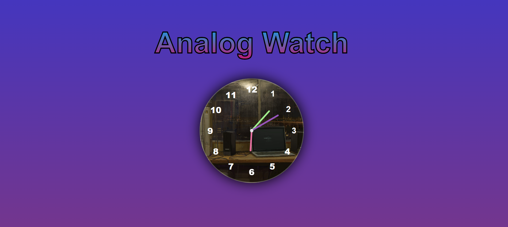

# Analog Watch 
making analog watch using html , css, js with dom functionaliy and little bit ai for css 🤭

#Technology used
1. Html
2. Css
3. JavaScript

#installation
1. clone the repo
2. git clone https://github.com/ashagrawal2107/js-related-project.git
3. open the project folder 
   - use cd Analog-Clock

